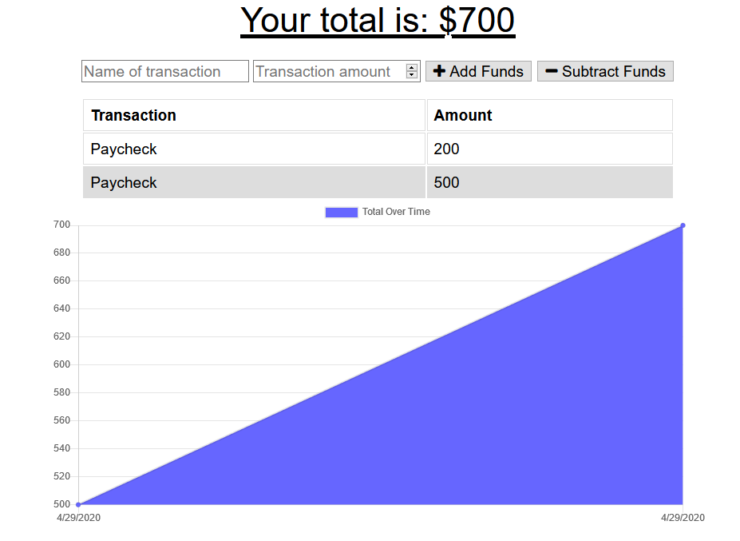
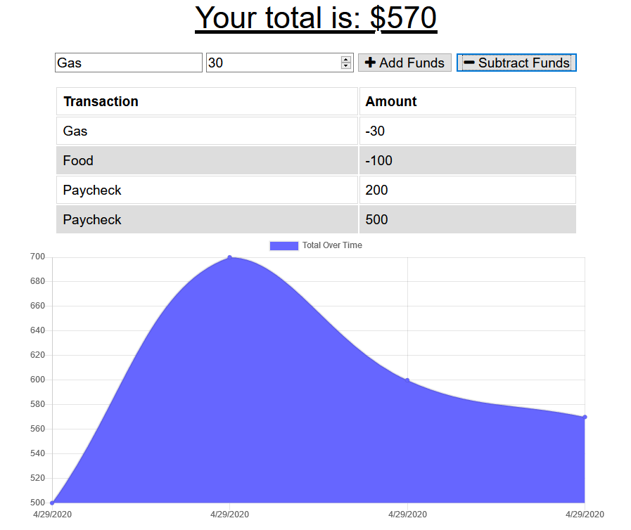

# Unit 18 PWA Homework: Online/Offline Budget Trackers

### Purpose

The user will be able to add expenses and deposits to their budget with or without a connection. When entering transactions offline, they should populate the total when brought back online.

### Functionality

I want to be able to track my withdrawals and deposits with or without a internet connection. Giving users a fast and easy way to track their money is important, but allowing them to access that information anytime is even more important. Having offline functionality is paramount to our applications success.

[Deployed Link](https://sparky-budget-tracker.herokuapp.com/)

## App Demo

### Add Funds 

### Subtract Funds

### Technologies Used 
 * NodeJS
 * JavaScript
 * Github API
 * HTML
 * CSS
